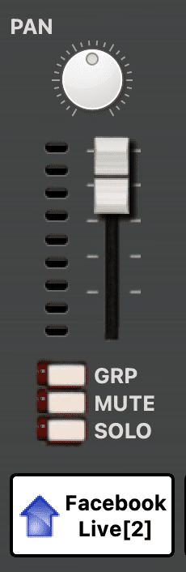
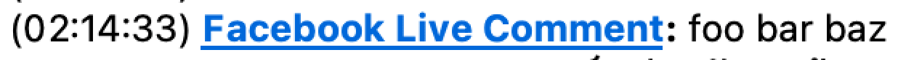

= fb-live-comments-to-jamulus-pipe

A simple integration when broadcasting jam sessions using https://github.com/dtinth/jamcaster:[jamcaster] to Facebook Live:

* Sends Facebook comments into Jamulus chat.
* Updates Jamcaster’s client name to reflect current number of live viewers.

.Live viewer display
====

====

.Live comments to Jamulus chat bridge
====

====

== Prerequisites

* https://github.com/dtinth/jamulus/tree/dtinth:[My fork of Jamulus server] running with JSON-RPC on port 22222.
* Jamcaster running with JSON-RPC forwarded to port 22100.
* A Facebook Graph API Page Access Token.

== Config

`config.json`:

[source,json]
----
{
  "accessToken": "…"
}
----

## Running the script

[source,shell]
----
bash -c 'while true; do node index.js; sleep 45; done'
----